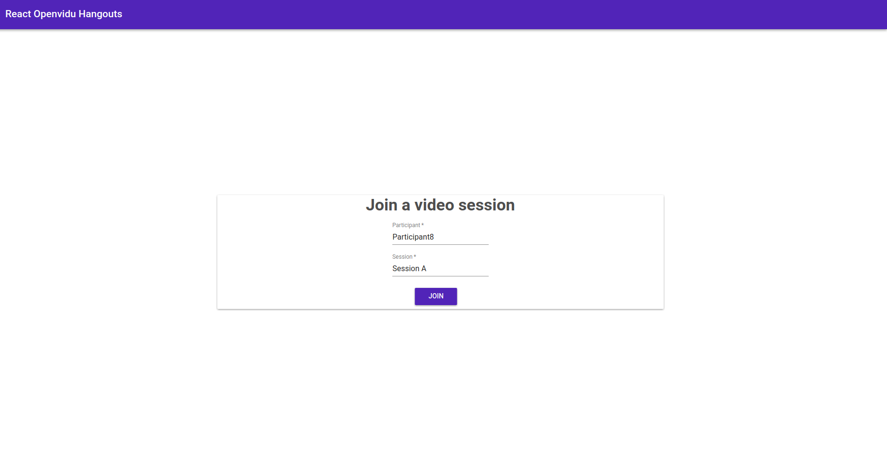
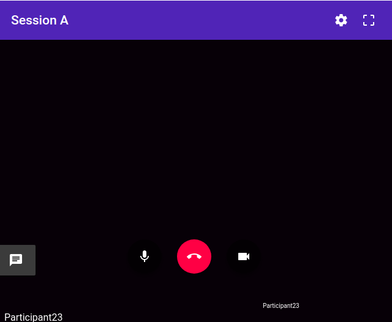

# Openvidu Hangouts React

**OpenviduHangoutsReact** is a room videoconference component library for [React](https://reactjs.org/).

It's written in [JavaScript](https://www.javascript.com/).

To be able to work in the browser, OpenviduReact uses [openvidu-browser](https://github.com/OpenVidu/openvidu/tree/master/openvidu-browser) to communicate with the [OpenVidu Server](https://github.com/OpenVidu/openvidu/tree/master/openvidu-server).

To use AngularOpenVidu, [WebRTC](https://en.wikipedia.org/wiki/WebRTC) support is required (Chrome, Firefox, Opera).

### Table of contents

- [App Demo](#app-demo)
- [Features](#features)
- [Installation](#installation)

### App Demo

<p align="center">
   
</p>

<p align="center">
   
</p>

In this [demo](https://github.com/srivasd/demo-openvidu-hangouts) you will see a use case of `openvidu-hangouts-react`, where you can test ALL the features included in this component.


### Features

- Join a group call
- Close group call
- Disable camera
- Mute microphone
- Toggle fullscreen video
- Send messages with a chat

### Installation

1. Install `openvidu-hangouts-react` node module through npm:

`npm i openvidu-hangouts-react --save` or `yarn add openvidu-hangouts-react `

2. Also you have to install some dependencies in order to import material library correctly:

`npm i @material-ui/core --save-dev`

`npm i @material-ui/icons --save-dev`

3. Import `OpenviduReact` to your App.js and use it in this way:

````
import React, { Component } from 'react';
import OpenviduReact from '../lib';
import './App.css';
import Card from '@material-ui/core/Card';
import CardActions from '@material-ui/core/CardActions';
import CardContent from '@material-ui/core/CardContent';
import TextField from '@material-ui/core/TextField';
import Button from '@material-ui/core/Button';
import AppBar from "@material-ui/core/AppBar";
import Toolbar from "@material-ui/core/Toolbar";
import Typography from "@material-ui/core/Typography";

  class App extends Component {

    constructor(props) {
      super(props);
      this.child = React.createRef();
      this.state = {
        valueSessionId: 'Session A',
        valueUserName: 'Participant' + Math.floor(Math.random() * 100),
        showLogin: true
      }

      this.onClick = this.onClick.bind(this);
      this.updateShowLogin = this.updateShowLogin.bind(this);
    }

    handleChangeSessionId(e){
      this.setState({
        valueSessionId : e.target.value,
      });
    }
  
    handleChangeUserName(e){
      this.setState({
        valueUserName : e.target.value,
      });
    }

    onClick(e) {
      this.child.current.joinSession();
      this.updateShowLogin(e);
    }

    updateShowLogin(e) {
      e.preventDefault();
      this.setState({
        showLogin: !this.state.showLogin
      })
    }

    render () {
      var valueSessionId = this.state.valueSessionId;
      var valueUserName = this.state.valueUserName;
      var valueShowLogin = this.state.showLogin;
      return (
        <div id= "main-container" className="container">
        { valueShowLogin === true ? 
        <div id="join">
          <AppBar position="static" color="primary">
            <Toolbar>
              <Typography variant="title" color="inherit">
                React Openvidu Hangouts 
              </Typography>
            </Toolbar>
          </AppBar>
          <div id="join-dialog" className="jumbotron vertical-center">
          <Card className="card">
              <Typography variant="display1" color="secondary" align="center">
                  Join a video session
              </Typography>
              <form className="form-group" onSubmit={this.handleSubmit}>
              <CardContent className="card-login">
                  <TextField className="form-control" type="text" label="Participant" id="userName" value={valueUserName} onChange={this.handleChangeUserName.bind(this)}required/>
                  <br />
                  <br />
                  <TextField className="form-control" type="text" label="Session" id="sessionId" inputRef={(input) => { this.sessionId = input; }} value={valueSessionId} onChange={this.handleChangeSessionId.bind(this)}required/>
              </CardContent>
              <CardActions className="button-login">
                <Button variant="raised" color="primary" id="join-button" name="commit" onClick={this.onClick}>
                  JOIN
                </Button>
              </CardActions>
          </form>    
          </Card>
          </div>
        </div> : null }
        <div id="videoCallContainer">
          <OpenviduReact updateLogin = {this.updateShowLogin} ref={this.child} wsUrl={"localhost"} sessionId={valueSessionId} participantId={valueUserName}/>
        </div>
        </div>
      );
    }
  }

export default App;
````

| Name | Type | Optional | Description |
|---|---|---|---|
| `wsUrl`			| `String` | required | Websocket URL pointing to your [OpenVidu Server][openvidu-server] |
| `sessionId`		| `String` | required | An id for the session you want to join to |
| `participantId`	| `String` | required | An id for the current participant joining the session |
| `updateLogin`	| `function` | required | Function to toggle between session states |
| `ref`	| `fucntion` | required | Refers the child component OpenviduReact in order to init session |


4. Run the following commands to start the app:

  `npm install`

  `npm start`

5. Deploy OpenVidu Server

Follow the instructions in [this page](https://openvidu.io/docs/releases/) to deploy it with docker.
